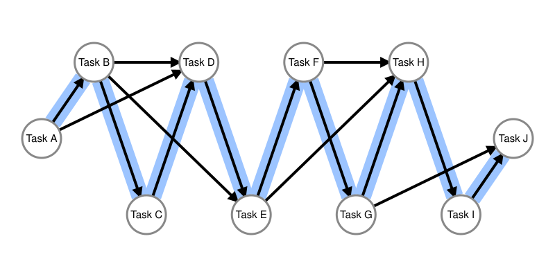
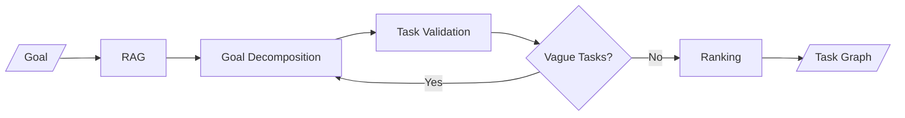
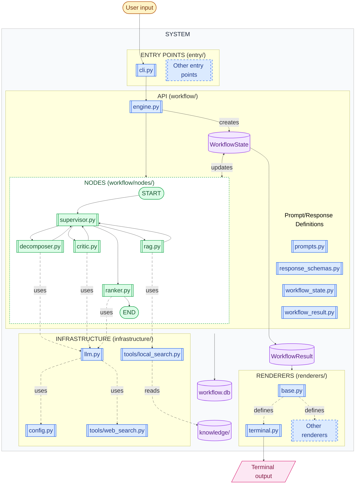

# Goal-to-Task Graph Engine

**Turns high-level goals into actionable tasks, structured as a directed graph to support planning.**

- [Goal-to-Task Graph Engine](#goal-to-task-graph-engine)
  - [Overview](#overview)
    - [Example](#example)
  - [Agentic Workflow](#agentic-workflow)
  - [Graph Construction and Ranking](#graph-construction-and-ranking)
    - [Example `WorkflowResult`](#example-workflowresult)
  - [System Architecture](#system-architecture)
  - [Directory Structure](#directory-structure)
  - [Basic Usage (Terminal)](#basic-usage-terminal)
  - [Adapting the Engine to Your Project](#adapting-the-engine-to-your-project)
    - [Entry Points](#entry-points)
    - [Custom Renderer](#custom-renderer)
    - [Additional Options](#additional-options)
  - [Todos / Future Work](#todos--future-work)
  - [License](#license)

## Overview

The Goal-to-Task Graph Engine is a multi-agent workflow that turns a user-provided goal into a set of actionable tasks for high-level implementation planning.

The generated tasks are represented as graph nodes, with relationships such as task dependencies captured as graph edges. The resulting structured plan can be consumed by downstream applications such as task managers, Kanban boards, checklists, timelines, and execution systems.

The system uses an LLM for task generation and specialized workflow stages for validation, revision, and ranking.



**Figure legend:** Nodes represent tasks. Arrows ("dependency edges") represent task dependencies: an arrow from one node to another means the source task must be completed before the target task. The blue path highlights the "sequence edges" and shows the suggested order in which tasks are performed. A task graph may contain isolated components when tasks have no dependencies; for simplicity, this figure shows a fully connected example.


### Example

Input: a high-level goal. For example:

```text
Plan a camping trip next month.
```

Output: A list of task nodes in a heuristic topological ordering, sorted by dependency depth, urgency, and importance.

```text
[Task 1] Select a 3-day weekend in the next 2 months that works for all participants
[Task 2] Create a 3-day meal plan including breakfast, lunch, dinner, and snacks
[Task 3] Select a campsite based on desired activities, amenities, and travel distance
[Task 4] Buy groceries
[Task 5] Research camping regulations
[Task 6] Reserve campsite
[Task 7] Check weather forecast
[Task 8] Create packing list
[Task 9] Gather camping gear
[Task 10] Pack car
```

Each task node in the returned graph looks like this:

```json
{
  "node_id": "task-006",
  "title": "Reserve campsite",
  "urgency": 5,
  "importance": 5,
  "depends_on": [
    "task-001",
    "task-003",
    "task-005"
  ],
  "rank": 6,
  "depth": 3
}
```

`node_id` is the internal graph identifier. Dependency references and graph edges use node IDs, while the terminal renderer displays dependencies using their human-readable ranks, such as `Task 1` or `Task 3`.

## Agentic Workflow

The following flowchart illustrates the main steps of the workflow:



These are the corresponding agents responsible for the above steps:

- **RAG**: Retrieves relevant planning context before task generation.
- **Decomposer**: Decomposes the high-level goal into candidate actionable tasks.
- **Critic**: Evaluates whether generated tasks are sufficiently concrete. Vague tasks are routed back for revision.
- **Ranker**: Adds metadata such as urgency, importance, and dependency relationships, builds the task graph, and computes a heuristic topological ordering using dependency depth, urgency, and importance.

This workflow adopts a supervisor pattern: a supervisor router chooses the next agent based on the current workflow state.

## Graph Construction and Ranking

After the critic accepts the task list, the ranker creates one graph node for each finalized task and assigns an internal `node_id` such as `task-001`. The LLM receives task titles when scoring tasks and identifying prerequisites. The ranker then maps those returned titles back to node IDs and stores the graph relationships internally as ID-based references.

The ranking algorithm is a heuristic topological ordering procedure:

1. Create nodes from the finalized, unique task titles.
2. Convert each prerequisite title returned by the LLM into a `node_id` and add a directed `dependency` edge from prerequisite to dependent task.
3. Compute each node's dependency depth recursively. A node with no prerequisites has depth `0`; a node depending on deeper nodes receives a larger depth.
4. Sort nodes by dependency depth, then by descending urgency, and finally by descending importance.
5. Assign the resulting sequence positions as `rank` values and add directed `sequence` edges between adjacent ranked nodes.

For an acyclic graph with valid dependency references, this ordering places every prerequisite before its dependent task and is therefore a valid topological ordering. Urgency and importance provide heuristic tie-breaking between tasks at the same dependency depth. The procedure does not search for a Hamiltonian path: unrelated tasks do not need direct edges between them, so a Hamiltonian path is not guaranteed to exist.

### Example `WorkflowResult`

When called without a renderer, `generate_task_graph()` returns a `WorkflowResult`. Its serialized form contains the goal, workflow metadata, and the explicit task graph:

```json
{
  "goal": "Plan a camping trip next month.",
  "thread_id": "38776541-52e5-4b1d-a86e-f262265a9093",
  "task_graph": {
    "nodes": [
      {
        "node_id": "task-001",
        "title": "Select dates",
        "urgency": 4,
        "importance": 5,
        "depends_on": [],
        "rank": 1,
        "depth": 0
      },
      {
        "node_id": "task-002",
        "title": "Reserve campsite",
        "urgency": 5,
        "importance": 5,
        "depends_on": ["task-001"],
        "rank": 2,
        "depth": 1
      }
    ],
    "edges": [
      {"source": "task-001", "target": "task-002", "type": "dependency"},
      {"source": "task-001", "target": "task-002", "type": "sequence"}
    ]
  },
  "tasks": ["Select dates", "Reserve campsite"],
  "verdicts": [],
  "context": [],
  "retries": 0,
  "agent_steps": 4
}
```

The `tasks` and `verdicts` fields preserve workflow state for inspection. The `task_graph` field is the structured planning output intended for downstream consumers.

## System Architecture



## Directory Structure

```text
.
├── entry/                          # Entry points
│   └── cli.py                      # Command-line interface 
├── infrastructure/                 # Shared services and config
│   ├── config.py                   # Env vars and constants
│   ├── llm.py                      # OpenAI-compatible LLM client helpers
│   └── tools/
│       ├── local_search.py         # Local vector search over knowledge base
│       └── web_search.py           # MCP web search
├── knowledge/                      # Knowledge base (reference material used for RAG)
│   └── goal_planning.md            # Guidance for task planning
├── renderers/                      # Output formatting for downstream consumers
│   ├── base.py                     # Renderer base class
│   ├── json.py                     # JSON output renderer
│   └── terminal.py                 # Terminal output renderer
├── workflow/                       # Main agentic workflow and state logic
│   ├── engine.py                   # Builds and runs the LangGraph workflow
│   ├── nodes/                      # Workflow stages
│   │   ├── critic.py               # Checks whether tasks are concrete enough
│   │   ├── decomposer.py           # Generates or revises tasks from the goal
│   │   ├── rag.py                  # Retrieves relevant context
│   │   ├── ranker.py               # Scores and ranks tasks
│   │   └── supervisor.py           # Routes between workflow stages
│   ├── prompts.py                  # Prompt templates for LLM
│   ├── response_schemas.py         # Pydantic schemas for structured model output
│   ├── workflow_result.py          # Final workflow result object
│   └── workflow_state.py           # State passed through the graph
├── .gitignore                      
├── .gitattributes                  
├── .env.example                    # Example environment configuration
├── pixi.toml                       # Pixi project and dependency configuration
├── pixi.lock                       # Locked dependency list
├── README.md
└── workflow.db                     # SQLite checkpoint database for workflow runs
```

## Basic Usage (Terminal)

1. Install the project dependencies with [Pixi](https://pixi.sh/).
2. Configure the environment variables in an `.env` file (see `.env.example`).
    - LLM API key, base URL and model name
    - Maximum tokens per LLM response
    - Web search MCP (default: Parallel Search)
3. To call the engine via terminal, run the CLI module as follows:

    ```bash
    pixi run python -m entry.cli "Plan a camping trip next month"
    ```

**Example terminal output**

```text
================================================================================
PLANNING STARTED | Thread: 38776541-52e5-4b1d-a86e-f262265a9093
================================================================================

🔎 Retriving context from knowledge base ...
Retrieved 1 context chunks.

📝 Analysing goal and writing tasks ...
Generated 10 tasks.

🤔 Evaluating tasks ...
Evaluated 10 tasks: 3 vague task(s) flagged for revision.

📝 Analysing goal and writing tasks ...
Generated 10 tasks.

🤔 Evaluating tasks ...
Evaluated 10 tasks: All tasks passed concreteness check (0 vague tasks).

🔢 Ranking tasks by dependency, urgency, and importance ...
✅ Execution plan finalised! Total planning steps: 6

================================================================================
EXECUTION PLAN | Thread: 38776541-52e5-4b1d-a86e-f262265a9093
Scale: [1 = Low, 5 = High]
================================================================================

[Task 1] Select a 3-day weekend in the next 2 months that works for all participants
- Urgency:    ● ● ● ● ○  (4/5)
- Importance: ● ● ● ● ●  (5/5)
- Depends On: None

[Task 2] Create a 3-day meal plan including breakfast, lunch, dinner, and snacks
- Urgency:    ● ● ● ○ ○  (3/5)
- Importance: ● ● ● ● ○  (4/5)
- Depends On: None

[Task 3] Select a campsite based on desired activities, amenities, and travel distance
- Urgency:    ● ● ● ● ○  (4/5)
- Importance: ● ● ● ● ●  (5/5)
- Depends On: Task 1

[Task 4] Buy groceries
- Urgency:    ● ● ● ● ○  (4/5)
- Importance: ● ● ● ● ●  (5/5)
- Depends On: Task 2

[Task 5] Research camping regulations
- Urgency:    ● ● ● ○ ○  (3/5)
- Importance: ● ● ● ● ○  (4/5)
- Depends On: Task 3

[Task 6] Reserve campsite
- Urgency:    ● ● ● ● ●  (5/5)
- Importance: ● ● ● ● ●  (5/5)
- Depends On: Task 1, Task 3, Task 5

[Task 7] Check weather forecast
- Urgency:    ● ● ○ ○ ○  (2/5)
- Importance: ● ● ● ○ ○  (3/5)
- Depends On: Task 1, Task 6

[Task 8] Create packing list
- Urgency:    ● ● ● ○ ○  (3/5)
- Importance: ● ● ● ● ○  (4/5)
- Depends On: Task 3, Task 7

[Task 9] Gather camping gear
- Urgency:    ● ● ● ○ ○  (3/5)
- Importance: ● ● ● ● ○  (4/5)
- Depends On: Task 8

[Task 10] Pack car
- Urgency:    ● ● ● ● ●  (5/5)
- Importance: ● ● ● ● ●  (5/5)
- Depends On: Task 9, Task 4

```

## Adapting the Engine to Your Project

### Entry Points

The core engine (`workflow/engine.py`) accepts a prompt (the goal) (e.g. from the terminal via the provided CLI module, `entry/cli.py`) and returns a `WorkflowResult` object when called without a renderer, or an object rendered by the selected renderer (e.g. Terminal stdout, if `TerminalRenderer` is selected).

To call the engine via an entry point other than the provided CLI module (e.g. a graphical user interface, direct API call, MCP call, etc), import `generate_task_graph` in your code and call it with the prompt:

```python
from workflow.engine import generate_task_graph

result = generate_task_graph(prompt)
```

### Custom Renderer

Note that the above output is a `WorkflowResult` object (see `workflow/workflow_result.py`). It can be rendered as JSON using `.to_dict()`, or passing the provided JSON renderer in the project: 

```python
from renderers.json import JsonRenderer

result_json = generate_task_graph(
    prompt,
    renderer=JsonRenderer(),
)
```
You can create a custom renderer for your project and call `generate_task_graph()` with the renderer. The renderer should follow the abstraction defined in `renderers/base.py`.

### Additional Options

You can resume the last session by passing the `thread_id` argument to `generate_task_graph()`. It can be found in `WorkflowResult.thread_id` from that session:

```python
result = generate_task_graph(prompt, thread_id)
```

To stream the agentic process and see the workflow steps in real time, pass a function that receives streaming messages (strings) to the `on_progress` argument of `generate_task_graph()`. For example, `terminal.display()`:

```python
result = generate_task_graph(
    prompt,
    renderer=terminal,
    on_progress=terminal.display,
)
```

## Todos / Future Work

- Feature: Add `workflow.db` management options, e.g. clear
- Development: Set up an evaluation pipeline
- Feature: Add task granularity option
- Feature: Add min/max task number option 
- Performance: Expand knowledge base
- Performance: Optimize prompts
- Performance: Check for duplicate tasks
- Performance: Explore other graph algorithms
- Cost: Optimize token usage
- Cost: Reduce LLM calls
- Feature: Add a graph visualization renderer
- Robustness: Implement more comprehensive error handling
- Robustness: Implement more comprehensive input/output validations
- Refactor: Extract hardcoded settings and constants (e.g. max retries) into `config.py` 

## License

[GNU General Public License v3.0](/LICENSE)
